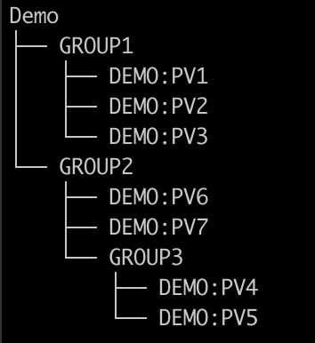

# Demo

The following PV tree will be used for the demo:




We represent this tree with the configuration file in `examples/demo/demo.xml`.

```yaml
<?xml version='1.0' encoding='utf8'?>
<config name="Demo">
    <component name="GROUP1">
        <pv name="DEMO:PV1">
            <enabled>true</enabled>
            <filter>DEMO:PV2 > 10</filter>
        </pv>
        <pv name="DEMO:PV2">
            <enabled>true</enabled>
        </pv>
        <pv name="DEMO:PV3">
            <enabled>true</enabled>
        </pv>
    </component>
    <component name="GROUP2">
        <component name="GROUP3">
            <pv name="DEMO:PV4">
                <enabled>true</enabled>
            </pv>
            <pv name="DEMO:PV5">
                <enabled>true</enabled>
            </pv>
        </component>
        <pv name="DEMO:PV6">
            <enabled>true</enabled>
        </pv>
        <pv name="DEMO:PV7">
            <enabled>true</enabled>
        </pv>
    </component>
</config>
```

Notice that `DEMO:PV1` has an enabling filter based on the value of `DEMO:PV2`. This results in a disabled `DEMO:PV1` for values of `DEMO:PV2` less than or equal to ten.

This demo is intended for running on SLAC's RHEL7 dev server; however, this same demo can be executed on machines provided that an apropriate environment is sourced. NALMS uses named Docker containers and so this demo cannot be run if the existing demo containers are running. The commands below are run using the existing RHEL7 docker installation. Users must be added to the docker group in order to interact with the containers. 

For client use: $NALMS_CLIENT_JAR must be defined as well as $NALMS_HOME. The client launch script creates a templated configuration file for the client from a template provided in $NALMS_HOME. 

## If running...
If the service containers have already been deployed, you can access cruise control at: http://localhost:9090, the Grafana instance at: http://localhost:3000, and launch the client using:


```
$ source ${PACKAGE_TOP}/nalms/setup/aird-b50-srv01/demo.env
$ nalms start-phoebus-client Demo
```

## From scratch

During this demo, we set up all services using the package CLI and the Docker images. On aird-b50-srv01, this can be sourced using: 


```
$ source ${PACKAGE_TOP}/nalms/setup/aird-b50-srv01/demo.env
```

Start the demo ioc:

```
$ tmux new -s demo-ioc
$ softIoc -d ${NALMS_HOME}/examples/demo/demo.db 
```
Exit the tmux window using: `Ctr + b + d`

Set up Kafka cluster (from repo root): 

```
$ nalms start-zookeeper 
$ nalms start-kafka-broker --broker 0
```

Start cruise-control:
```
$ nalms start-cruise-control
```
Navigate to [http://localhost:9090](http://localhost:9090) to view the Cruise Control interface and monitors of the Kafka cluster. 


Start the Phoebus alarm server: (Note: launch requires the absolute path of the configuration file for docker volume mount)


```
$ nalms start-alarm-server Demo ${NALMS_HOME}/examples/demo/demo.xml
```


Next, start the Elasticsearch service: 
```
$ nalms start-elasticsearch
```

Wait at least a minute before starting elasticsearch. The templates for the indices must be created before starting. Start the Phoebus alarm logger:
```
$ nalms start-alarm-logger Demo ${NALMS_HOME}/examples/demo/demo.xml
```

Now we'll add the configuration to be handled with Grafana. Add the Grafana datasource to the file:
```
$ nalms add-grafana-datasource Demo
```

This appended the datasource to the file `datasource.yml`. Now, create the Grafana dashboard:
```
$ nalms build-grafana-dashboard Demo
```

This created a dashboard for the Demo configuration in $NALMS_GRAFANA_DASHBOARD_DIR. Launch the Grafana instance:
```
$ nalms start-grafana
```

Launch firefox and navigate to [http://localhost:3000](http://localhost:3000). Select AlarmLogs from the available dashboards.

Provided that you've installed the Phoebus client using the [directions](install.md), set the environment variable NALMS_CLIENT_JAR to the client jar file. Then, launch the Phoebus client:
```
$ nalms start-phoebus-client Demo
```

Navigate to `Applications > Alarm > Alarm Tree` to view the process variable values. Navigate to `Applications > Alarm > Alarm Log`


To inspect the Docker containers run:
```
$ docker ps # to list container ids
$ docker stats {CONTAINER_ID}
```


## Cleanup

All containers may be stopped using the ids listed with:

```
$ docker ps
$ docker stop {containter_id}
```

Remove lingering containers...
```
 $ docker container rm {container_id}
```

You can access and exit the demo ioc by attaching to the tmux session:

```
$ tmux attach -t demo-ioc
```
Exiting the softIOC, and `Ctrl + b + d`.