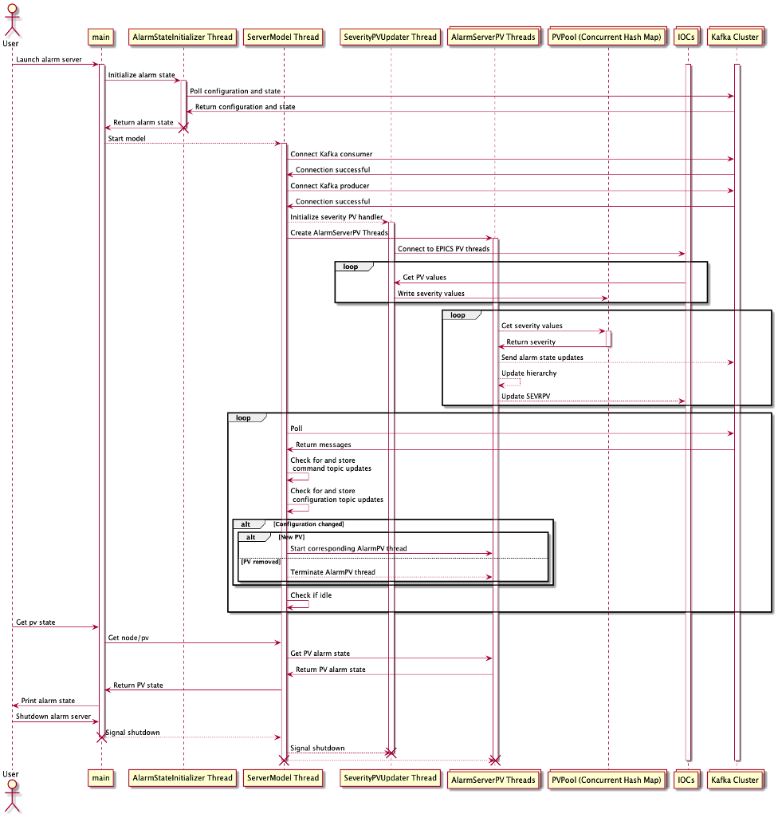
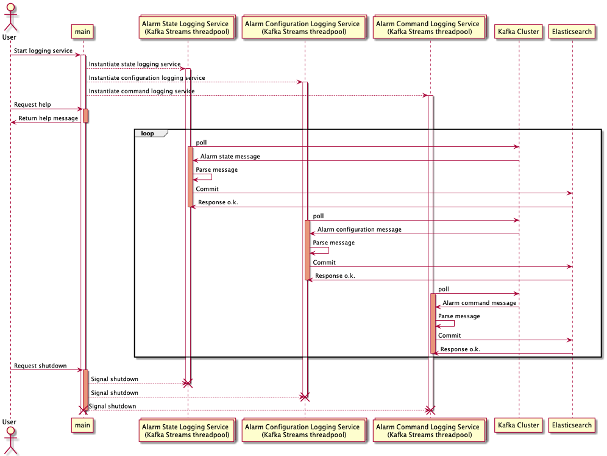

# Phoebus Alarm Server

For the translation of IOC alarm state to Kafka message and the handling of configuration and command representations, the new alarm system will use the CS-Studio Collaboration Phoebus alarm server. Alarm updates are configurable for receipt over Channel Access and pvAccess using either the “ca://” or “pva://” prefix in the PV name configuration, respectively. Both may be used in a single configuration. 
 
The CS-Studio community has approved the following features for development:

* The configuration topic schema will be extended to include a variable number of miscellaneous tags
* The XML parsing model must be modified to accommodate nested inclusions
* The Alarm erver functionality must be extended to allow for the assignment of an expiration date for alarm bypasses. 
 
Documentation for the Phoebus Alarm Server may be found [here](https://control-system-studio.readthedocs.io/en/latest/app/alarm/ui/doc/index.html).

## Configuration files 

Alarm configurations are XML files organized with component (group), and PV tags. Component tags accept specifications for guidance, display, commands, and automated actions. Configuration options for groups are defined below:

| Configuration tag        | Description                                                                               |
|--------------------------|-------------------------------------------------------------------------------------------|
| guidance                 | Message explaining the meaning of an alarm to the user and who to contact for resolution  |
| display                  | Link to the associated control system display                                             |
| command                  | Commands that may be invoked from user interfaces                                         |
| automated_action         | Action performed when a group enters and remains in an active alarm state.                |

PV tags accept specifications for enabling, latching, annunciating, description, delay, commands, associated displays, guidance, alarm count, filter, and automated actions. A configuration schema is provided [here](https://github.com/slaclab/nalms/blob/main/phoebus-alarm-server/files/phoebus_alarm_server.xsd).

| Configuration tag        | Description                                                                               |
|--------------------------|-------------------------------------------------------------------------------------------|
| guidance                 | Message explaining the meaning of an alarm to the user and who to contact for resolution  |
| display                  | Link to the associated control system display                                             |
| command                  | Commands that may be invoked from user interfaces                                         |
| automated_action         | Action performed when a group enters and remains in an active alarm state.                |
| description              | Text displayed in the alarm table when the alarm is triggered                             |
| delay                    | Alarm will be triggered if the PV remains in alarm for at least this time                 |
| enabled                  | If false, ignore the value of this PV                                                     | 
| latching                 | Alarms will latch to the highest severity until the alarm is acknowledged and cleared.    |
|                          | If false, alarm may recover without requiring acknowledgment                              |
| count                    | If the trigger PV exhibits a not-OK alarm severity for more than ‘count’ times within the |
|                          | alarm delay, recognize the alarm                                                          |
| filter                   | An optional expression that can enable the alarm based on other PVs.                      |

# Phoebus Alarm Logger

The Phoebus alarm logger is used for the translation of Kafka messages to Elasticsearch. While multiple configurations may be grouped into a single logger, this consolidation may lead to logging outages in the event of configuration deprecation or configuration deployment. For this reason, it may be suitable to run a designated alarm logger instance per configuration.  
 

Elasticsearch is a search engine build over the widely used Apache Lucene library, a Java-based search and indexing tool. Elasticsearch manages Lucene at scale, managing indices in a distributed fashion and providing additional data management and access features. JSON documents are written to an Elasticsearch server where they are tokenized, analyzed, and stored alongside indexed data representations of field values.

Elasticsearch indices are created for the alarm events using following schemes, using the creation date of the index: `{config_name}_alarms_state_yyyy_mm_dd,  {config_name}_alarms_config_yyyy_mm_dd, and {config_name}_alarms_cmd_yyyy_mm_dd`. Indices are duration based using a default of one month. This may be reduced or extended based on volume. 

Elasticsearch supports aggregated metrics accessible via query including percentiles, summations, and averages. Custom expressions may be evaluated using the packaged scripting API, written in the painless language, or by building a custom Java plugin.

Index aliasing may be a more effective way to handle the indices, with rollover of old indices automated, to avoid implicit datecoding of log names. More sophisticated elasticsearch lifecycle management should be explored and the [X-pack](https://www.elastic.co/guide/en/elasticsearch/reference/current/getting-started-index-lifecycle-management.html#ilm-gs-create-policy) enterprise option considered.

| Index	                                  | Field                                                |
|-----------------------------------------|------------------------------------------------------|
| {config_name}_alarms_state_yyyy_mm_dd	  | config (pv path with topic prefix)                   |
|	                                      | current_message                                      |
|                                         | current_severity                                     |
|                                         | latch                                                |
|                                         | message                                              |
|                                         | message_time                                         |
|                                         | mode                                                 |
|                                         | notify                                               |
|                                         | pv                                                   |
|                                         | severity                                             |
|                                         | time                                                 |
|                                         | value                                                |
| {config_name}_alarms_config_yyyy_mm_dd  | config                                               |
|                                         | config_msg                                           |
|                                         | enabled                                              |
|                                         | host                                                 |
|                                         | latch                                                |
|                                         | message                                              |
|                                         | user                                                 |
| {config_name}_alarms_cmd_yyyy_mm_dd	  | command                                              |
|                                         | config                                               |
|                                         | host                                                 |
|                                         | message_time                                         |
|                                         | user                                                 |
