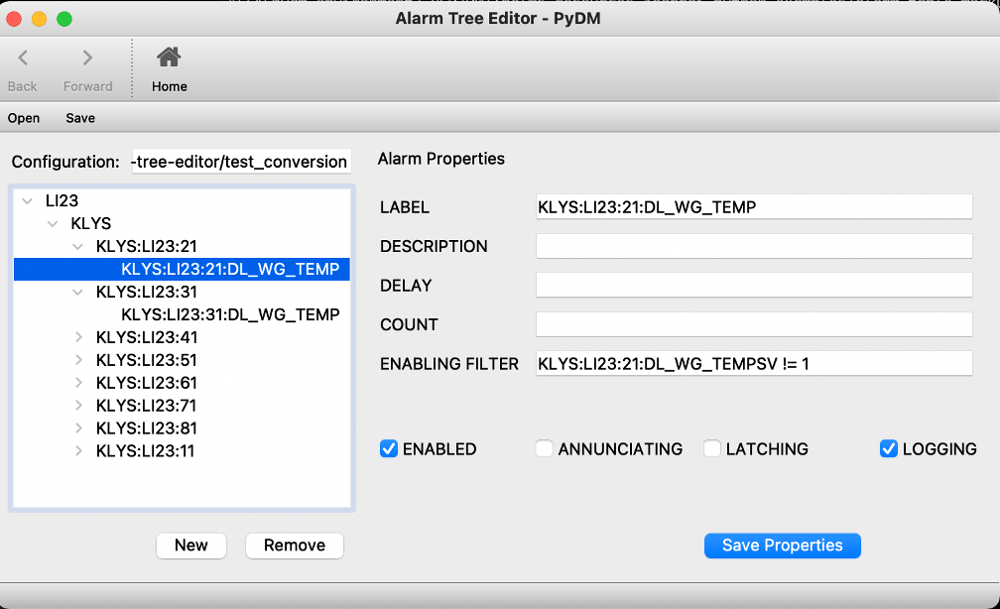

# Tools

## Alarm Configuration Editor Tool



The alarm configuration editor is be a PyQt tool for designing the alarm configuration XML files for use with the Phoebus alarm server as outlined in Section 3.2. Alternatively, any XML editor may be used to build the document directly. The editor has the following features:  
* Ability to edit alarm hierarchy, create new groups and new PVs 
* Ability to define all configuration items
* Optional conversion and import of legacy ALH files 

Requirements for running the editor are given in the `environment.yml` file bundled with the NALMS package. This environment can be created with conda using:
```
$ conda env create -f environment.yml
```

And subsequently activated:
```
$ conda activate nalms
```

If choosing to build your own environment without conda, the requirements follow:
  - python =3.8
  - treelib
  - lxml
  - pyqt5
  - kafka-python
  - pydm

PyDM dependence will eventually be dropped.   

To launch the editor run:
```
$ bash cli/nalms launch-editor
```

## PyDM widgets

PyDM widgets are in the development stage and relevant code is hosted in [pydm-nalms](https://github.com/slaclab/pydm-nalms). The integration of the datasource with PyDM is largely dependent upon the development of [entrypoints](https://github.com/slaclab/pydm/issues/720) for datasources. This feature request is still open and therefore intermediate use will require modifying PyDM directly or monkeypatching... 

## NALMS-tools


### ALH Conversion

The ALH conversion tool is a python script for the conversion of legacy Alarm Handler Configuration tools. This script provides a command line interface for the purpose of translating an indicated Alarm Handler configuration file into a Phoebus alarm server -compatible XML configuration file, recursively iterating over its inclusions. Further, a report will be generated during execution describing the mapping of original to translated filenames and omissions of incompatible configuration elements. 

Of the configuration elements defined by the Alarm Handler, ALIAS, ACKPV, SEVRCOMMAND, STATCOMMAND, and BEEPSEVERITY have no analogs in the Phoebus alarm server.  

It is assumed that SEVRCOMMAND and STATCOMMAND will be handled inside the alarm system logic as justified in Section 3.2.1. BEEPSEVERITY, ACKPV, and ALIAS functionality will be deprecated. At SLAC, survey of the configuration utilization suggested that the LCLS makes no use of the STATCOMMAND and makes minimal use of the SEVRCOMMAND for sending emails in the case of high severity alarms. 

For use see [legacy](legacy.md).